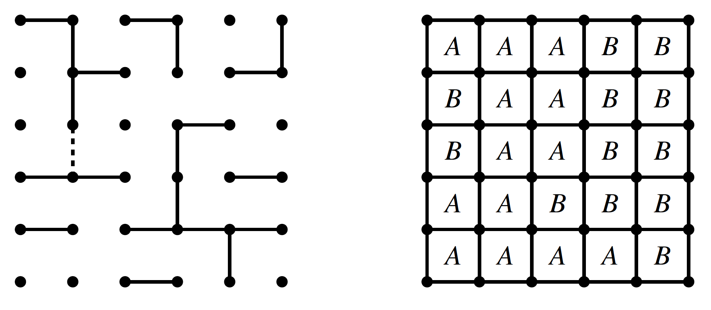

Dots-And-Boxes is a two-player (typically the players are denoted as A and B) strategy game with simple rules which can be played with just paper and pencil. The game starts with an empty grid of points. Both players in turn connect two adjacent points either by vertical or horizontal lines. It is not allowed to fill in a line more than once. If a player manages to complete the fourth line of a box she takes the ownership of this box and must perform an additional move, hence, draw another line. A player may but is not forced to capture a box if other moves are still available. The game ends after all lines on the grid are drawn. The player who owns the most boxes in the end wins the game. If both players captured the same amount of boxes, the match is considered as a tie. A tie is only possible for those boards which consist of an even number of boxes. An example for a typical Dots-And-Boxes position on a 5 x 5 grid is given in the following figure:

One important characteristic of this game is the possibility to vary the size of the grid as desired. Theoretically, Dots-And-Boxes can be played on all grids with M x N boxes (with M,N > 0), which corresponds to a grid with (M+1) x (N+1) points. M and N may be varied in order to steer the complexity of the game, although not all combinations of M and N may be reasonable, since many are trivially solvable or induce an overly complex problem. Since the state-space complexity and the game tree size rapidly grow with increasing grid size, the largest board to be solved until today has the size of 4 x 5 boxes, which took about one month on a 3.33GHz Xeon machine. In order to solve the 4 x 5 board, Barker & Korf performed a classical alpha-beta search with several game-specific enhancements for pruning the search-tree. Additionally, the search was supported by a 24GB transposition table.
In general, the complexity for different board sizes can be estimated as follows: for a M x N board, there are 

p = 2MN+M+N = M(N+1)+N(M+1)

possible edges that can be filled in. The game-tree size, hence, the total number of possible games that can be played from the empty board, is then p!. For example, a 4 x 4 board with p=40 has a game tree size of 40! which is about 8 * 10^{47}, which makes it impossible for a naive Minimax-search to solve. Since many permutations of a move sequence lead to the same game state, the state-space complexity is several orders of magnitude smaller (This is beneficial for tree-search algorithms with transposition tables, since recurring nodes do not have to be expanded again, one can simply retrieve the game-theoretic value from the transposition-table). Moreover, the estimation of the state-space complexity can be simplified if only the edge configuration of a board is considered; for the decision-making process the information about the number, the owners and the position of captured boxes is not relevant, since both players attempt to maximize the number of boxes with their remaining moves. Additionally, Dots-And-Boxes is an impartial game: the player to move is irrelevant for decision-making, the optimal move in a certain situation is the same for both opponents. With these observations, only two possible states (empty and filled) per edge have to be considered, so that the state-space complexity is simply given by 2^p. Again, for a 4 x 4 board, the state-space complexity would then be 2^{40} = 1.1* 10^{12}. In comparison with Connect-4, the game-tree complexity for the 4 x 4 board is larger by approximately 27 orders of magnitude due to the large branching factor of Dots-And-Boxes. The state-space complexity for both games is comparable.
In, Berlekamp approaches Dots-And-Boxes in far more depth with combinatorial game theory and discusses many theoretical and strategical aspects, such as the relation between Dots-and-Boxes and the game Strings-and-Coins, Nimber values,  double-crosses, chain rules, half- and hard-hearted handouts, loony moves and more.
